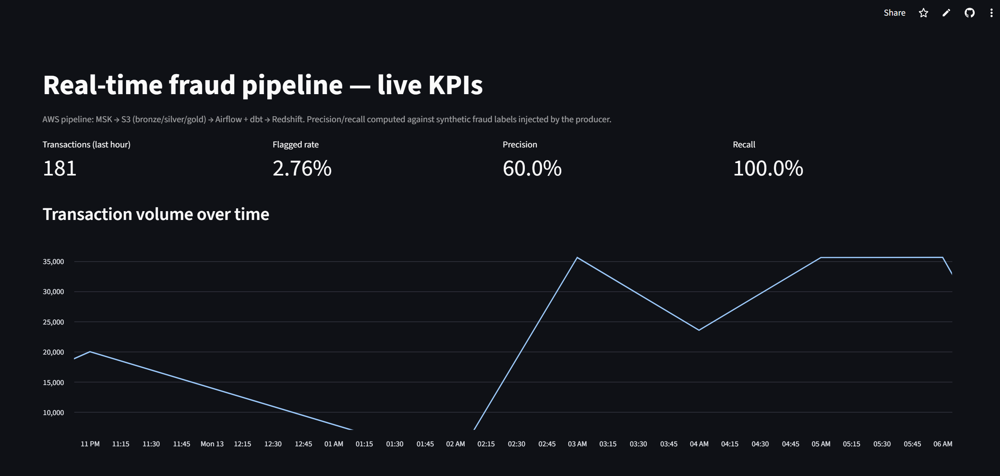
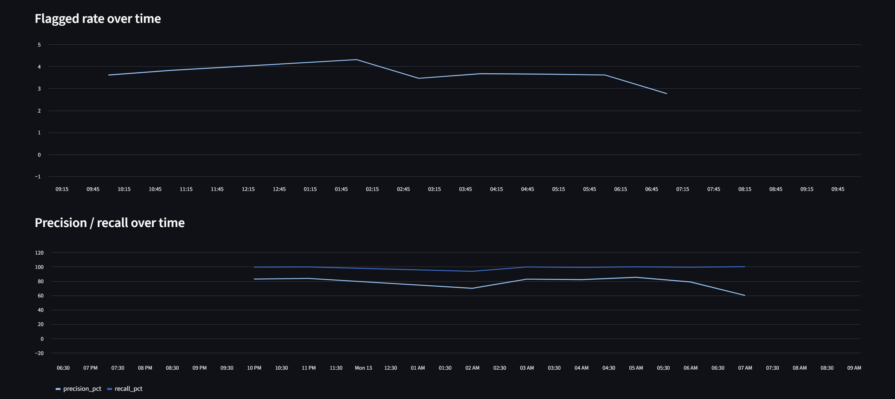
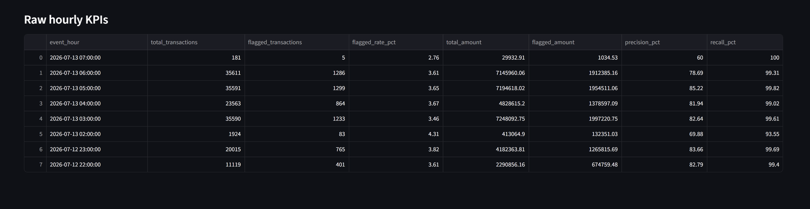

# Real-Time Fraud Detection Pipeline (AWS)

**[Live Dashboard →](https://fraud-detection-pipeline-aws-pm6eucverun24cmdymmvor.streamlit.app/)**

A production-style, end-to-end fraud/anomaly detection pipeline built and
deployed on AWS — covering cloud infrastructure, data engineering, and
analytics in one system. Simulated transactions stream through Kafka, get
scored for fraud in real time, land in a data lake, get transformed and
quality-checked on a schedule, and surface on a live public dashboard.

Every piece of this is real and running — no mocked services, no fabricated
numbers. The bugs found and fixed along the way are documented below, not
hidden, because they're part of the actual engineering story.

## Screenshots





## Architecture

```
Producer (simulated transactions, ~10/sec)
        │
        ▼
   Amazon MSK (managed Kafka) — SASL/SCRAM auth, ACL-enforced, public access
        │
        ▼
   Consumer  ──────────────►  Fraud scoring (rules: mismatched location,
        │                      high amount, card velocity)
        ▼
   S3 data lake (bronze, partitioned by date)
        │
        ▼
   Redshift Spectrum (external table over S3)
        │
        ▼
   Airflow (hourly DAG)  ──►  dbt: bronze → silver → gold
        │                          │
        │                          ▼
        │                    Data quality checks (SQL-based, gates gold build)
        ▼
   Redshift Serverless (silver/gold native tables)
        │
        ▼
   Streamlit dashboard (public) — live KPIs, precision/recall, charts

Infra: Terraform, cost-minimized (Redshift Serverless, no NAT Gateway,
Docker-based local Airflow instead of MWAA)
```

## Why MSK over Kinesis

Chose Amazon MSK (managed Kafka) instead of Kinesis: Kafka is the more
transferable, industry-standard skill (Kinesis is AWS-proprietary), and it
let this project reuse real Kafka experience from an earlier project
(Kafka → Neo4j streaming pipeline).

## Repo layout

| Folder | Purpose |
|---|---|
| `terraform/` | VPC, IAM, MSK, S3, Redshift Serverless — all infra as code |
| `producer/` | Simulates transaction events (with injected fraud patterns), publishes to MSK |
| `consumer/` | Reads from MSK, applies fraud rules, writes scored events to S3 |
| `dbt/` | Transformation models: bronze (Spectrum view) → silver (cleaned) → gold (hourly KPIs) |
| `dbt/setup_spectrum.py` | One-time script to create the Spectrum external schema/table |
| `airflow/` | Dockerized Airflow — orchestrates dbt + data quality checks hourly |
| `dashboards/streamlit_app.py` | Public dashboard, deployed on Streamlit Community Cloud |
| `great_expectations/` | Early exploration of GE-based data quality — superseded by the lighter SQL-based checks now living directly in the Airflow DAG (see note below) |
| `monitoring/` | Prometheus config (not yet wired up — CloudWatch metrics from the consumer cover basic observability for now) |
| `.github/workflows/` | CI/CD — Terraform plan/apply, Python lint/test |

## A real engineering decision, not a shortcut

Originally planned to gate the pipeline's `silver → gold` promotion with
Great Expectations. In practice, GE's Data Context/Checkpoint setup added
real operational overhead disproportionate to this project's size. Swapped
to direct SQL-based integrity checks (null/duplicate/range checks via
`redshift_connector`) run inline in the Airflow DAG — same purpose, far
fewer moving parts. Worth being upfront about this if it comes up in an
interview: it's a "right-sized tool" call, not something abandoned halfway.

## Real, measured results

Measured against the producer's synthetic fraud labels, on live streaming data:

- **Precision: ~78–86%** in high-volume hours (20K–35K+ transactions)
- **Recall: ~93–100%** — catches nearly all injected fraud patterns
- **Flagged rate: ~3–4%**, tracking close to the ~3% synthetic fraud
  injection rate

**Precision is noisier in low-volume hours** — e.g. one hour with only 181
transactions and 5 flags showed 60% precision, versus the steady 78–86%
seen in hours with tens of thousands of transactions. Small sample sizes
swing more; this is expected statistical behavior, not a scoring problem,
and worth knowing before quoting a single "the" precision number out of
context.

**A real bug, found and fixed:** the first version of this pipeline showed a
17% flagged rate against a 3% fraud injection rate — a genuine false-positive
problem. Root cause: the card fingerprint pool (500 unique cards) was too
small relative to event rate, causing legitimate transactions to randomly
collide on the velocity-check rule. Fixed by widening the pool to 5,000.
Found by measuring against ground truth, not by code review — a good example
of why you check the numbers instead of assuming the logic is right because
it reads reasonably.

## Setup

```bash
# 1. AWS credentials + billing safety net (one-time)
aws configure
# Set a billing alarm: AWS Console -> Billing -> Budgets

# 2. Terraform variables
cd terraform
cp terraform.tfvars.example terraform.tfvars
# edit terraform.tfvars: set my_ip_cidr to your IP/32 (find at whatismyip.com)
export TF_VAR_redshift_master_password="..."
export TF_VAR_msk_scram_password="..."

# 3. Infra (~20-30 min first apply, mostly MSK/Redshift provisioning time)
terraform init
terraform plan
terraform apply

# 4. Bootstrap Kafka ACLs (one-time, required before producer/consumer can
#    run — grants the SASL/SCRAM app user permission on the transactions
#    topic and consumer group; bootstrapped via a temporary IAM-authenticated
#    connection since MSK denies-by-default with no ACLs yet)

# 5. Producer + consumer (separate terminals, keep both running)
cd ../producer && pip install -r requirements.txt
python producer.py --bootstrap-servers <public-sasl-scram-brokers> \
  --sasl-username fraudpipeline --sasl-password ... --rate 10

cd ../consumer && pip install -r requirements.txt
python consumer.py --bootstrap-servers <public-sasl-scram-brokers> \
  --sasl-username fraudpipeline --sasl-password ... \
  --bucket <your-data-lake-bucket>

# 6. Spectrum + dbt (one-time Spectrum setup, then dbt runs via Airflow)
cd ../dbt
python setup_spectrum.py --host <redshift-endpoint> --password ... \
  --role-arn <redshift_s3_read_role_arn output> --bucket <bucket>

# 7. Airflow (Docker)
cd ../airflow
docker compose up airflow-init
docker compose up -d
# http://localhost:8080, login airflow/airflow, trigger fraud_pipeline_hourly

# 8. Dashboard (local test, or deployed via Streamlit Community Cloud)
cd ../dashboards
pip install -r requirements.txt
streamlit run streamlit_app.py

# 9. Tear down when not actively running/demoing, to keep AWS cost near-zero
cd ../terraform
terraform destroy
```

## Cost note

Built cost-minimized on purpose: Redshift **Serverless** (bills per-second
only while querying, $0 when idle) and **no NAT Gateway** (MSK and Redshift
sit on public subnets with security groups scoped appropriately — MSK
restricted to a single IP for local development, Redshift opened for the
public dashboard since Streamlit Cloud has no fixed IP range to allowlist,
relying on username/password auth instead of network restriction for that
one service). Realistic total build cost: low single digits to ~$20,
largely covered by AWS's new-account free credits.

## Status

- [x] Terraform infra provisioned (MSK, Redshift Serverless, S3, IAM, VPC)
- [x] MSK authentication (SASL/SCRAM + IAM), ACL enforcement, public access
- [x] Producer/consumer streaming end-to-end with fraud scoring
- [x] Redshift Spectrum reading S3 directly
- [x] dbt models (bronze/silver/gold) running via Airflow, hourly
- [x] SQL-based data quality gate (swapped from Great Expectations — see note above)
- [x] Public dashboard deployed (Streamlit Community Cloud)
- [x] Real measured precision/recall, with an honest bug found and fixed
- [ ] Prometheus/Grafana observability (CloudWatch metrics from consumer cover the basics for now)
- [ ] Load-tested throughput beyond ~10 events/sec
